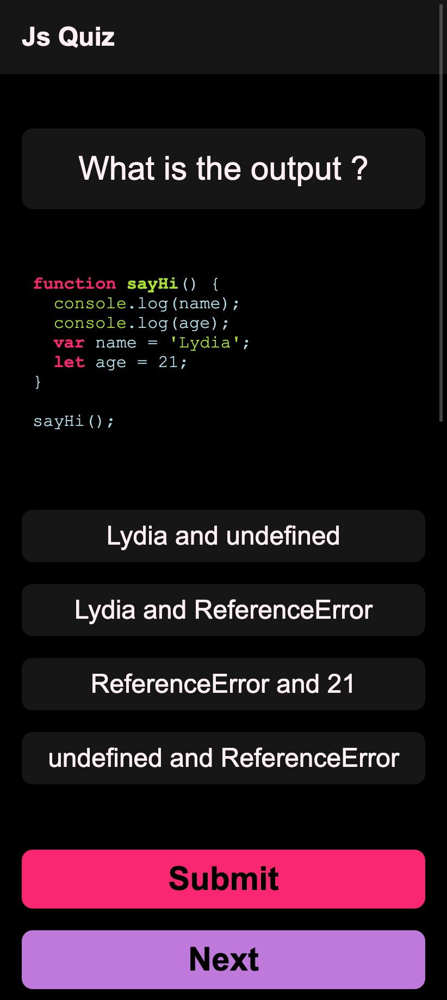

This project was bootstrapped with [Create React App](https://github.com/facebook/create-react-app).

## Available Scripts

In the project directory, you can run:

### `npm start`

Runs the app in the development mode. 
Open [http://localhost:3000](http://localhost:3000) to view it in the browser.

The page will reload if you make edits. 
You will also see any lint errors in the console.

> This app uses the [js_quiz_server](https://github.com/rjstyles/js_quiz_server), which should be run locally before running the app.

### Screenshot:

---

This repo uses [javascript-questions](https://github.com/lydiahallie/javascript-questions) to fetch and parse the quiz data.

Credits [lydiahallie](https://github.com/lydiahallie).
